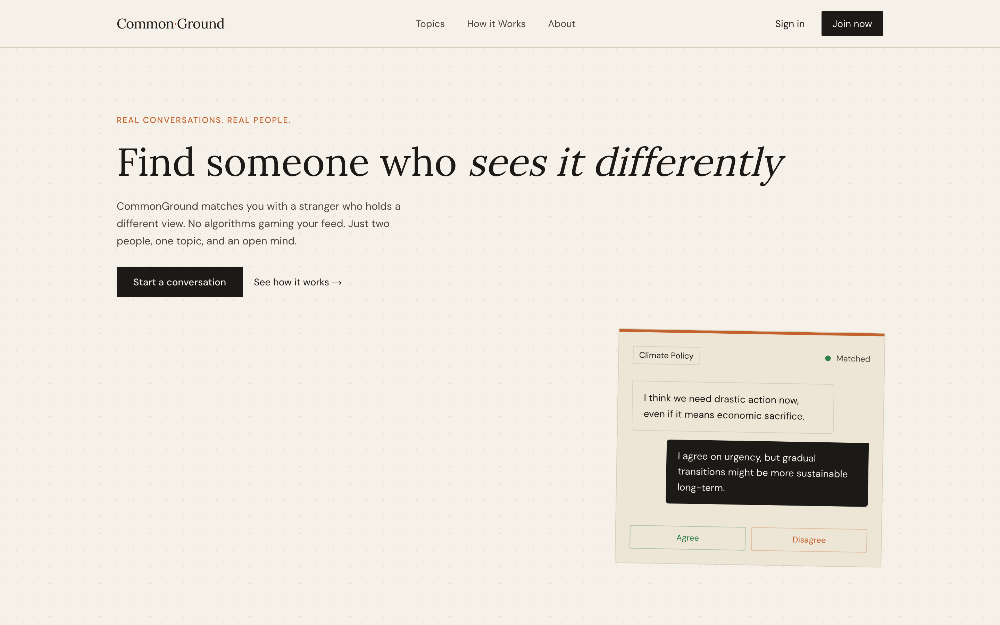

# CommonGround

CommonGround pairs two people who hold opposing views on a single debatable proposition, gives them one structured three-round conversation, and shows whether either of them actually moved.

**Live demo →** https://common-ground-amber-alpha.vercel.app/



It is deliberately not a social network: no feed, no followers, no algorithm. One topic, two people, then it ends. Built as a full-stack portfolio piece to demonstrate realtime systems, security-first data modelling, and an LLM-backed serverless agent.

## Features

- **Atomic matchmaking** — a Postgres `find_match` function using `FOR UPDATE SKIP LOCKED` pairs you with a partner holding the opposing stance, so simultaneous "find someone" clicks can't claim the same person.
- **Security-first data model** — Row-Level Security on every table; the web app only holds Supabase's publishable key, and all privileged writes (matches, round advances, reactions) run through `SECURITY DEFINER` functions with no client write policies to abuse.
- **Realtime chat without a bespoke socket server** — messages, reactions, round advances and match state stream over Supabase Realtime (Postgres logical replication), with RLS enforced on the realtime payloads themselves.
- **Serverless LLM debate bots** — five seeded bot partners driven by Groq (`llama-3.3-70b-versatile`) with per-bot personalities, dispatched via Supabase database webhooks to Vercel functions in production (or a local listener in dev), with graceful fallback to canned replies when the API is unavailable.
- **Stance-trajectory results** — three rounds gated by message thresholds, a stance vote after each, then a hand-rolled dual-line SVG chart (no charting dependency) reconstructing each participant's baseline → R1 → R2 → R3 path with a Converged / Held ground / Diverged verdict.
- **Tested end-to-end** — `node:test` unit tests for the pure logic plus a Playwright happy-path that drives a real browser from matching through three rounds of voting to the results verdict.

## Tech stack

Next.js 16 (App Router) · React 19 · TypeScript · Tailwind CSS v4 · shadcn/ui · Motion · Supabase (Auth · Postgres · Realtime · RLS) · Groq · Resend · Biome · Playwright · Vercel

## Running locally

Prerequisites: Node 20+, npm, and a Supabase project.

```bash
git clone https://github.com/shaandre96/common-ground.git
cd common-ground
npm install
```

Create a `.env.local` with the following variables:

```bash
NEXT_PUBLIC_SUPABASE_URL=https://<ref>.supabase.co
NEXT_PUBLIC_SUPABASE_ANON_KEY=sb_publishable_...
SUPABASE_SECRET_KEY=sb_secret_...   # server-only: scripts, tests, account deletion
BOT_PASSWORD=<any-string>           # shared password for the seeded bots
GROQ_API_KEY=gsk_...                # optional — bots fall back to canned replies if unset
RESEND_API_KEY=re_...               # required for the /contact form to send mail
```

Apply the migrations in `supabase/migrations/` in order via the Supabase SQL Editor, then:

```bash
npm run dev          # start Next on http://localhost:3000
npm run seed:bots    # create the 5 bot debate partners
npm run bot:dev      # local bot runner (listens to Realtime, dispatches bots)
```

## Notes

A full-stack portfolio project built to show realtime architecture, security-first Postgres/RLS design and a serverless LLM agent rather than plain CRUD. The same three stateless bot handlers run two ways — Supabase webhooks to Vercel functions in production, or a local Realtime listener in development.
